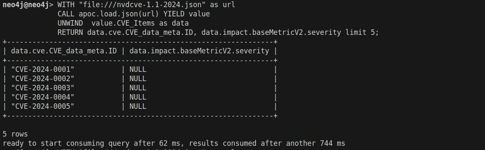

# NoSQL Graph DO5

## Import `neo4j_query_saved_cypher.csv`

To retrieve everything, import the file `neo4j/neo4j_query_saved_cypher.csv`.

## python

To test the connection, run the following command:

```bash
pyhton3 connection-test.py
```

To execute a Cypher query file using a Python client, use:

```bash
python3 execute-query.py <path_to_cypher_file> 
```

## cypher-shell

You can also execute a query using the Cypher CLI. Use the following command to connect:

```bash
cypher-shell -u neo4j -p your_password
```

## Screenshots

Here are some screenshots for illustration:




